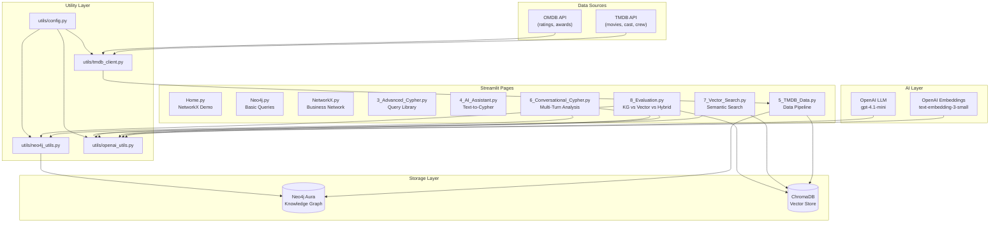
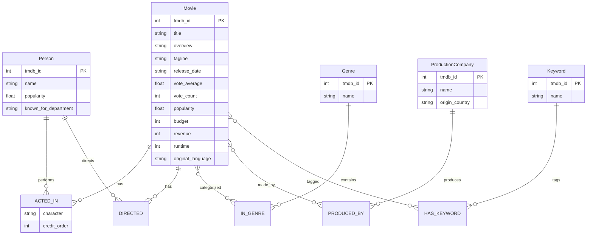
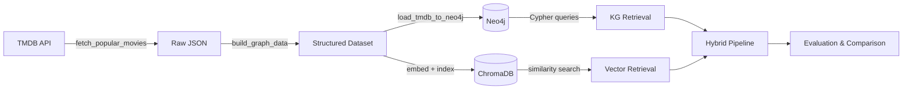
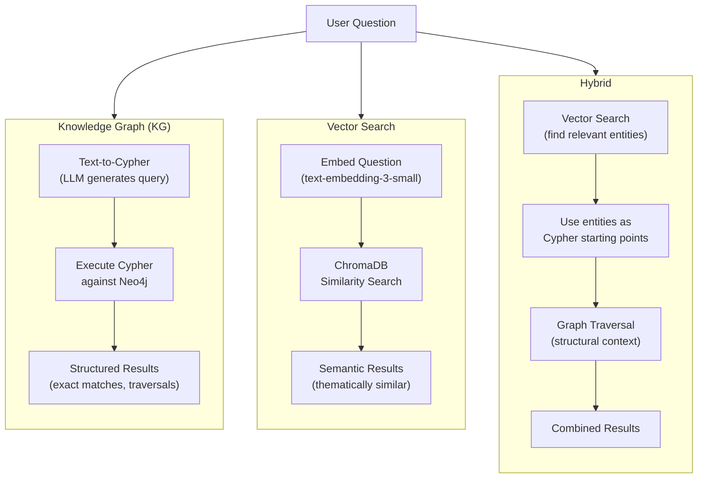

# Architecture

## System Overview

## Data Model (Neo4j)

## Data Pipeline

## Retrieval Strategy Comparison

## Technology Stack

| Component | Technology | Purpose |
|-----------|-----------|---------|
| Web Framework | Streamlit | Multi-page interactive UI |
| Graph Database | Neo4j Aura (cloud) | Knowledge graph storage and Cypher queries |
| Vector Database | ChromaDB (embedded) | Semantic similarity search |
| Embeddings | OpenAI text-embedding-3-small | Convert text to vectors |
| LLM | OpenAI gpt-4.1-mini | Text-to-Cypher, conversation |
| Data Source | TMDB + OMDB APIs | Movie metadata, cast, crew |
| Visualization | Pyvis, Plotly, Matplotlib | Graph and chart rendering |
| Graph Algorithms | NetworkX | Centrality, community detection |

## Page Dependencies

| Page | Neo4j | ChromaDB | OpenAI | TMDB API |
|------|-------|----------|--------|----------|
| Home | - | - | - | - |
| Neo4j | required | - | - | - |
| NetworkX | - | - | - | - |
| Advanced Cypher | required | - | - | - |
| AI Assistant | required | - | required | - |
| TMDB Data | required | optional | optional | required |
| Conversational Cypher | required | - | required | - |
| Vector Search | - | required | required | - |
| Evaluation | required | required | required | - |
