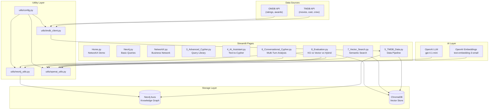
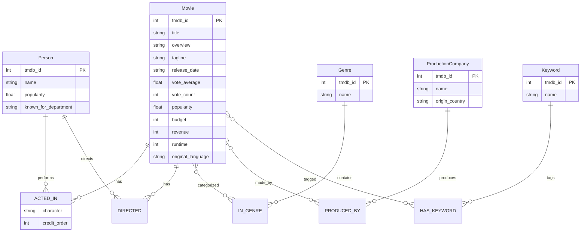
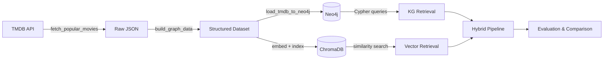
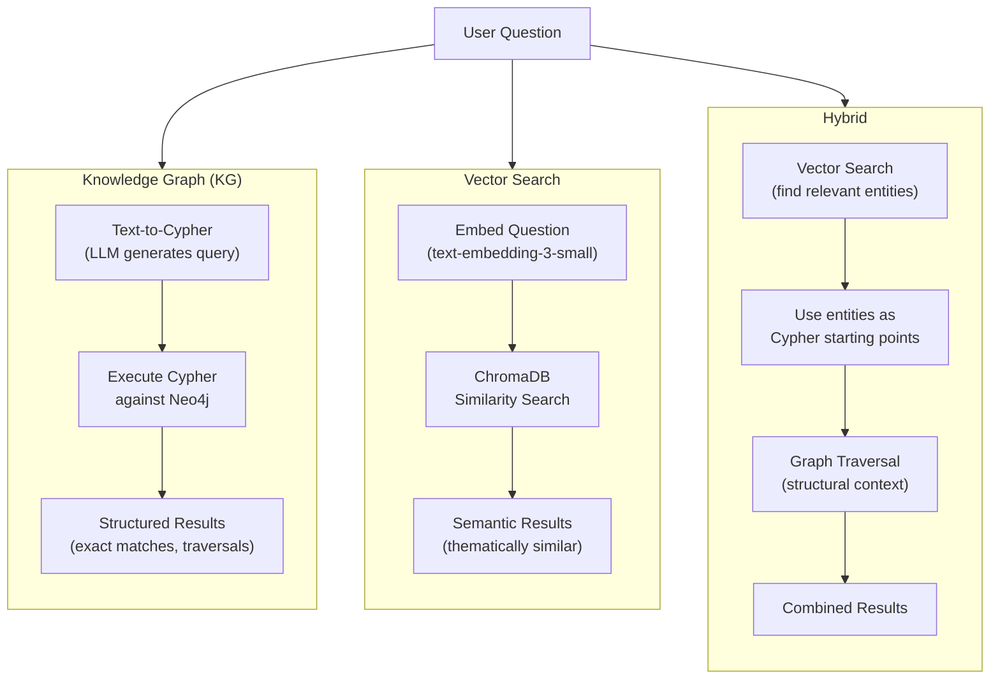

# Architecture

## System Overview

## Data Model (Neo4j)

## Data Pipeline

## Retrieval Strategy Comparison

### Strategy Pros and Cons

#### Knowledge Graph (Text-to-Cypher)

The KG approach converts natural language into Cypher via an LLM, then executes the query against Neo4j.

**Accuracy**: Highest for factual and structural questions. "Who directed Inception?" maps to a single graph traversal and returns the exact answer with no false positives. Aggregations (counts, averages, sums), multi-hop relationship queries ("actors who worked with directors of sci-fi movies"), and filtered lookups ("movies rated above 8.0 released after 2020") are all native operations. However, accuracy depends entirely on the LLM generating valid Cypher — a malformed query returns nothing, and there is no graceful degradation. Semantic or fuzzy questions ("movies with a dark vibe") fail because the graph stores structured properties, not meaning.

**Scalability**: Neo4j scales well into hundreds of millions of nodes and relationships. Index-backed lookups are O(log n). Relationship traversals are O(k) where k is the number of edges at each hop, independent of total graph size. The bottleneck is the LLM call for Cypher generation (~500-1500ms), not the graph query itself (typically <50ms for indexed lookups). For very complex multi-hop queries, execution time grows with traversal depth but remains bounded by LIMIT clauses.

**Speed**: Two-phase latency: LLM generation (500-1500ms) + Cypher execution (10-200ms). Total typical latency is 0.7-2s. The LLM call dominates. Caching generated Cypher for repeated question patterns can bring repeat queries down to <100ms. No embedding computation needed at query time.

**Failure modes**: LLM generates syntactically invalid Cypher (query error), LLM hallucinates property names or relationship types not in the schema (empty results), user asks about concepts not modeled in the graph (no answer possible).

#### Vector Search (Semantic Similarity)

The vector approach embeds the user question and finds the most similar documents (movie overviews) in ChromaDB by cosine distance.

**Accuracy**: Highest for thematic and conceptual queries. "Find movies about humanity's struggle against artificial intelligence" will surface The Matrix, Terminator, and Ex Machina even if none contain that exact phrase — because their overviews are semantically close in embedding space. However, vector search cannot answer structural questions: it cannot count ("how many sci-fi movies?"), aggregate ("average rating by genre"), traverse relationships ("who directed those movies?"), or filter precisely ("movies with budget > $100M"). It returns approximate matches ranked by similarity, not exact answers. Precision drops on highly specific factual queries where the answer is a single entity.

**Scalability**: ChromaDB in embedded mode handles up to ~1M documents comfortably. Beyond that, a dedicated vector database (Pinecone, Weaviate, Qdrant) is needed. Embedding storage is O(n) where n is document count. Each document stores a 1536-dimensional float vector (~6KB). For 100 movies this is negligible (~600KB). For 1M movies it's ~6GB. ANN (approximate nearest neighbor) search is sub-linear — typically O(log n) to O(sqrt(n)) depending on the index type. Adding new documents requires computing embeddings (OpenAI API call), which is the throughput bottleneck at ingest time.

**Speed**: Fastest at query time for single-step retrieval. Embedding the question: ~100-200ms (OpenAI API). ChromaDB ANN search: <10ms for collections under 100K documents. Total typical latency: 150-300ms. No LLM call needed for retrieval (only for embedding). This makes vector search 3-5x faster than KG for simple lookups.

**Failure modes**: Returns results for every query (never "no results"), which means it can return irrelevant matches with misleadingly high similarity scores. Cannot distinguish between "no good match" and "good match" — the top-k results always come back. Embedding quality depends on the document text — movies with short or generic overviews get poor embeddings.

#### Hybrid (Vector + Knowledge Graph)

The hybrid approach uses vector search as a first pass to identify relevant entities, then feeds those into structured Cypher queries for graph traversal.

**Accuracy**: Consistently the highest across all question types. For factual questions, the vector context helps the LLM generate more targeted Cypher (e.g., knowing the movie title from semantic search prevents hallucinating wrong entity names). For semantic questions, the graph traversal adds structural context that pure vector search misses (e.g., finding thematically similar movies AND their directors, budgets, and shared actors). For complex questions ("find highly-rated sci-fi movies about AI and show who directed them"), it combines the semantic understanding of "about AI" with the structural precision of genre filters and director relationships. The main accuracy risk is the same as KG: the LLM must still generate valid Cypher for the second phase.

**Scalability**: Inherits the scaling characteristics of both systems. The vector search phase scales as described above. The KG phase scales as described above. The combined pipeline adds no new scaling concern — the vector search returns a small candidate set (typically 5-20 entities) that bounds the subsequent graph traversal. In practice, the hybrid approach can be *more* scalable than pure KG because the vector pre-filter narrows the search space before expensive multi-hop traversals.

**Speed**: Slowest of the three due to sequential phases. Vector search (150-300ms) + LLM Cypher generation (500-1500ms) + Cypher execution (10-200ms). Total typical latency: 0.8-2.5s. The two API calls (embedding + LLM) dominate. Parallelizing the vector search and LLM generation is possible for queries where the Cypher doesn't depend on vector results, but the default pipeline is sequential. For latency-sensitive applications, caching both embeddings and generated Cypher is essential.

**Failure modes**: Inherits failure modes from both approaches. If vector search returns irrelevant candidates, the graph traversal starts from wrong entities. If the LLM generates bad Cypher, the pipeline falls back to vector-only results (graceful degradation). The additional complexity means more surface area for bugs — two storage systems to keep in sync, two query paths to monitor.

### Summary Comparison

| Dimension | Knowledge Graph | Vector Search | Hybrid |
|-----------|----------------|---------------|--------|
| **Factual accuracy** | Excellent | Poor | Excellent |
| **Semantic accuracy** | Poor | Good | Good |
| **Complex query accuracy** | Good | Poor | Excellent |
| **Query latency** | 0.7-2s | 0.15-0.3s | 0.8-2.5s |
| **Ingest throughput** | Fast (structured writes) | Slower (embedding computation) | Both required |
| **Storage efficiency** | High (only properties + edges) | Moderate (1536-dim vectors) | Both required |
| **Max practical scale** | Billions of nodes (Neo4j Enterprise) | ~1M docs (ChromaDB embedded) | Bounded by vector store |
| **Aggregations & counts** | Native | Not possible | Native (via KG phase) |
| **Relationship traversal** | Native (multi-hop) | Not possible | Native (via KG phase) |
| **Fuzzy/thematic matching** | Not possible | Native | Native (via vector phase) |
| **Graceful degradation** | No (query error = no results) | Yes (always returns top-k) | Partial (falls back to vector) |
| **Infrastructure complexity** | Single database | Single database | Two databases + sync |
| **LLM dependency at query time** | Yes (Cypher generation) | No (only embedding) | Yes (Cypher generation) |

### When to Use Each Approach

**Use Knowledge Graph alone** when your questions are primarily structural: exact lookups, relationship traversals, aggregations, path finding, and filtered queries over well-modeled domains. Best when the schema is stable and query patterns are predictable.

**Use Vector Search alone** when your questions are primarily semantic: "find similar items", content recommendation, thematic discovery, and exploratory search where approximate results are acceptable. Best when the data is unstructured text and you need fast, simple retrieval without a graph model.

**Use Hybrid** when your application spans both structured and semantic queries, or when you need the highest possible accuracy across diverse question types. The added infrastructure and latency cost is justified when incorrect or incomplete answers have meaningful consequences — e.g., analytical workflows, research assistants, and customer-facing Q&A over complex domains.

## Technology Stack

| Component | Technology | Purpose |
|-----------|-----------|---------|
| Web Framework | Streamlit | Multi-page interactive UI |
| Graph Database | Neo4j Aura (cloud) | Knowledge graph storage and Cypher queries |
| Vector Database | ChromaDB (embedded) | Semantic similarity search |
| Embeddings | OpenAI text-embedding-3-small | Convert text to vectors |
| LLM | OpenAI gpt-4.1-mini | Text-to-Cypher, conversation |
| Data Source | TMDB + OMDB APIs | Movie metadata, cast, crew |
| Visualization | Pyvis, Plotly, Matplotlib | Graph and chart rendering |
| Graph Algorithms | NetworkX | Centrality, community detection |

## Page Dependencies

| Page | Neo4j | ChromaDB | OpenAI | TMDB API |
|------|-------|----------|--------|----------|
| Home | - | - | - | - |
| Neo4j | required | - | - | - |
| NetworkX | - | - | - | - |
| Advanced Cypher | required | - | - | - |
| AI Assistant | required | - | required | - |
| TMDB Data | required | optional | optional | required |
| Conversational Cypher | required | - | required | - |
| Vector Search | - | required | required | - |
| Evaluation | required | required | required | - |
